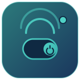

<p align="center">
  
</p>

<h1 align="center">Tuya Dashboard</h1>

<p align="center">
  A self-contained inventory &amp; troubleshooting dashboard for local Tuya devices &mdash;
  as a native Home Assistant integration, or as a standalone web app.
</p>

<p align="center">
  <a href="https://github.com/sajid2310/tuya-dashboard/stargazers"></a>
  <a href="https://github.com/sajid2310/tuya-dashboard/issues"></a>
  <a href="https://github.com/sajid2310/tuya-dashboard/commits/master"></a>
  
  
  <a href="LICENSE"></a>
</p>

---

Tuya's local protocol is well documented, but *finding out what you actually
have* &mdash; which devices exist, what their current IP and local key are,
whether they're reachable, and why one has gone offline &mdash; is the part
that's usually missing. This project is that missing inventory layer, built
two ways from the same core logic:

- **[`custom_components/tuya_dashboard`](custom_components/tuya_dashboard)**
  &mdash; a native Home Assistant integration, installed via HACS. This is
  the actively maintained, recommended way to use this project.
- **[`app.py`](app.py)** &mdash; a standalone Flask web app for anyone who
  wants the same dashboard without running Home Assistant at all.

Both combine three discovery methods (LAN broadcast, the Tuya Cloud API, and
a MAC/ARP subnet sweep) into one inventory table, plus an independent
local-vs-cloud diagnose tool that tells you in plain English which side of a
connectivity problem you're looking at.

## Contents

- [Home Assistant integration](#home-assistant-integration-recommended)
- [Standalone dashboard](#standalone-dashboard)
- [Features](#features)
- [How discovery works](#how-discovery-works)
- [Security](#security)
- [License](#license)

## Home Assistant integration (recommended)

A self-contained custom panel &mdash; no external Lovelace card, no
dependency on another Tuya integration. It's built to run safely
**alongside** LocalTuya or the official Tuya integration: by default it
never opens a connection to your devices, relying instead on the Tuya Cloud
API and passive broadcast listening. Optional local polling, when turned on,
runs on its own slow, configurable schedule (default 15 minutes) rather than
every sync, so an occasional local check is very unlikely to collide with
another integration's persistent connection.

### Install via HACS

1. In Home Assistant, open **HACS**.
2. Click the three-dot menu (top right) &rarr; **Custom repositories**.
3. Add `https://github.com/sajid2310/tuya-dashboard`, category **Integration**.
4. Find **Tuya Local Dashboard** in HACS and install it.
5. Restart Home Assistant.
6. **Settings &rarr; Devices & Services &rarr; Add Integration &rarr; Tuya Local Dashboard.**
   Cloud credentials are optional (see below) &mdash; you can also run it
   LAN-only.
7. A **Tuya Devices** panel appears in the sidebar.

### Optional: Tuya Cloud credentials

Local scanning alone can find devices on your network, but Tuya only hands
out a device's `local_key` through the cloud once it's linked to your
account. To get names, categories and local keys auto-filled:

1. Create a free account at [iot.tuya.com](https://iot.tuya.com) and a
   **Cloud Project** (the Trial plan is enough).
2. Under the project's **Devices** tab, choose *Link Tuya App Account* and
   scan the QR code with the Smart Life / Tuya Smart app your devices are
   registered to.
3. Copy the project's **Access ID** and **Access Secret** into the
   integration's setup form.

### Options

Configurable from the integration's **Configure** button:

| Option | Default | What it does |
|---|---|---|
| Background re-sync interval | 120s | How often the cloud list + broadcast/ARP scan run |
| LAN broadcast listen time | 12s | How long each sync listens for device broadcasts |
| Poll devices locally | off | Opens a real local connection to read live on/off/DP state |
| Local poll interval | 900s (15 min) | Independent cadence for local polling, so it's safe to enable even alongside LocalTuya |

## Standalone dashboard

For anyone who wants the same inventory table without Home Assistant.

```bash
cd tuya-dashboard
pip install -r requirements.txt
python app.py
# open http://<this machine's IP>:8080
```

Or with Docker (must run with **host networking** &mdash; discovery needs to
see LAN broadcast traffic, which bridge-mode containers can't see):

```bash
docker compose up -d
```

Must run on the same LAN as your Tuya devices &mdash; see
[Notes & limitations](#notes--limitations) below for why. Full setup,
credential storage, and production notes are further down this README.

## Features

- **Inventory table** &mdash; name, online/offline status, IP, device ID,
  local key (masked, click to reveal), protocol version, category, and
  type-appropriate controls, for every device on your account.
- **Diagnose** &mdash; checks local (LAN) and Tuya Cloud connectivity
  independently for one device and gives a plain-English verdict: is this a
  local network issue, a cloud/internet issue on the device's side, or is
  everything fine.
- **Type-aware controls** &mdash; a single toggle for simple switches, one
  toggle per gang for multi-gang switches, and power + speed controls for
  fans, instead of one generic on/off button.
- **Type filters** &mdash; split the inventory by switch / plug / light /
  fan / other, plus online / offline / missing-key filters.
- **Last refreshed indicator** *(Home Assistant integration)* &mdash; always
  visible, so it's obvious whether what's on screen is current.
- **Coexists with LocalTuya** *(Home Assistant integration)* &mdash; if
  LocalTuya is also installed and already knows a device's IP, this
  integration reads that (a safe, in-memory, read-only lookup) rather than
  re-discovering it, so the inventory stays populated even on networks where
  broadcast/ARP can't reach the devices from wherever Home Assistant sits.

## How discovery works

Three methods, merged into one table:

1. **LAN broadcast** &mdash; passively listens for the UDP broadcasts Tuya
   devices already send out on your network (no connection opened).
2. **Tuya Cloud API** &mdash; using your Access ID/Secret, pulls your full
   device list: names, categories, and local keys.
3. **MAC/ARP sweep** &mdash; for devices the cloud API knows about but the
   broadcast scan missed, probes local subnets on Tuya's local port and
   cross-references the OS ARP table to resolve a current IP from a known
   MAC address.

### Notes & limitations

- Broadcast and ARP-based discovery only work within the same LAN
  segment/VLAN as the devices &mdash; they don't cross subnet boundaries.
  If Home Assistant or the standalone app run on a different subnet than
  your Tuya devices, discovery can come up empty even though the devices
  are perfectly reachable over routed unicast (which is what the optional
  local-polling / LocalTuya-fallback paths use instead).
- Not every device broadcasts continuously, and some newer protocol
  versions are quieter. If a device doesn't show up on the first sync, try
  again, or check it's powered on and connected to Wi-Fi.
- This project is independent, built on the
  [tinytuya](https://github.com/jasonacox/tinytuya) library. It is not
  affiliated with Tuya, Home Assistant, or LocalTuya.

## Security

- **Home Assistant integration**: cloud credentials and device local keys
  are stored using Home Assistant's own config entry storage, the same
  mechanism every other integration uses &mdash; nothing is written outside
  of Home Assistant's own storage directory.
- **Standalone app**: your Tuya Access Secret and every device's local key
  are encrypted at rest with [Fernet](https://cryptography.io/en/latest/fernet/)
  (AES-128-CBC + HMAC) in `data/config.json` / `data/devices.json`, decrypted
  only in memory when needed. `data/` is gitignored and should never be
  committed. See the encryption key notes in
  [`app.py`](app.py) before deploying beyond a local test.
- This repository's full history has been checked for committed secrets,
  credentials, and local keys &mdash; none are present. Please still double
  check before opening a public fork or PR that nothing device-specific from
  your own account is included.

## License

[MIT](LICENSE)
